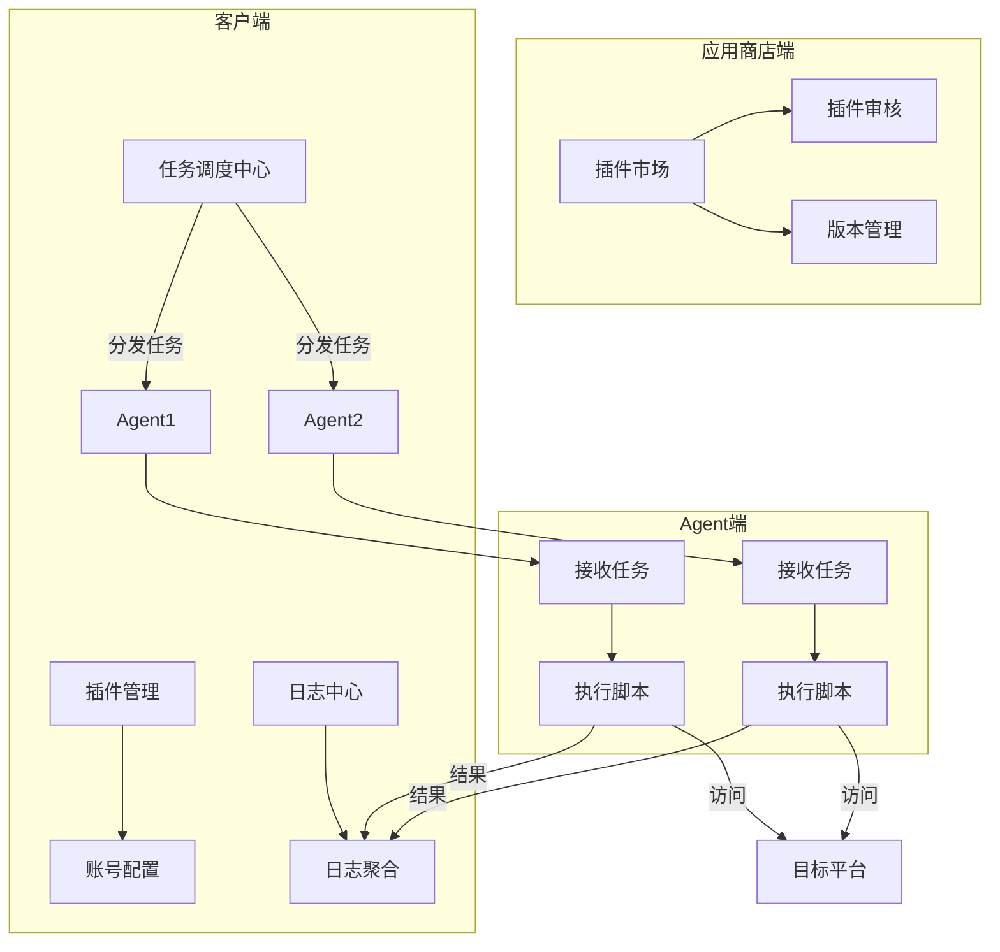
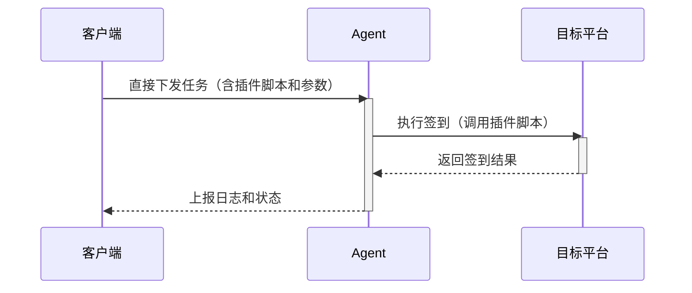

# cc-auto-sign-server cc-auto-sign的后端服务

一个基于React 19和Ant Design 5构建的现代化签到管理系统，使用Vite作为构建工具。

## 写在前面
目前还没有完成，只是把页面实现了，agent写完了，这个页面的服务端还在写。

## 目前的想法
### 架构图

### 任务下发时序图

## 项目概述

突发奇想打算做一个插件化的自动签到系统，由开发者维护插件商店，其他人可自行上传写好的签到插件，又多个node节点去执行签到任务（需自行部署node节点），这样不同签到任务可以用不同地区的服务器来签到。

## 主要功能

### 仪表盘

### 插件商店

### 任务管理

### 节点管理

### 日志查看
