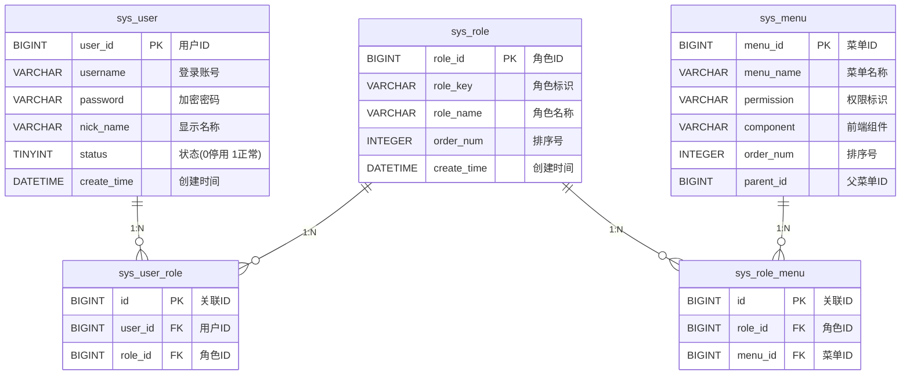

# CC-ADMIN 敏捷开发框架

[](https://dev.mysql.com/)
[](https://openjdk.org/)
[](https://www.centos.org/)
[](https://redis.io/)

> 基于Spring Boot的轻量化敏捷开发框架，具备RBAC权限控制、自动代码生成等核心功能
---
## 🧰 核心组件
[](https://spring.io/projects/spring-boot)
[](https://sa-token.cc/)
[](https://baomidou.com/)

---
## 🚀 快速启动

### 前置要求
- xxx
- xxx
- xxx
### 配置指南
- xxx
- xxx
- xxx

---
## ✨ 核心特性
- **模块化架构设计**：前后端分离，支持微服务扩展
- **高效代码生成器**：一键生成Entity/DAO/Service/Controller基础代码
- **权限管理体系**：细粒度RBAC权限控制，支持按钮级别权限管理
- **监控与预警**：集成健康检查、性能监控等运维功能
- **标准化接口规范**：RESTful API设计，严格的HTTP状态码管理
---
## 📡 接口响应规范

### HTTP状态码映射表
| HTTP Status | Body Code | 说明                     | 典型场景               |
|-------------|-----------|--------------------------|-----------------------|
| 200         | 200       | 请求成功                 | 正常业务响应           |
| 400         | 400       | 参数校验失败             | JSON格式错误/必填字段缺失 |
| 401         | 401       | 身份认证失败             | Token过期/无效Token    |
| 403         | 403       | 访问权限不足             | 接口权限未授予          |
| 404         | 404       | 资源不存在               | 无效API路径           |
| 500         | 500       | 系统内部错误             | 未捕获异常/NPE错误     |

### 标准响应结构
```json
{
  "code": 200,
  "msg": "success",
  "data": {
    // 业务数据内容
  },
  "timestamp": 1751508990518
}
```
---


## 🛠️ 二次开发
xxxxx

---
## 📄 许可证
[](LICENSE)

Copyright (c) 2025 CC-ADMIN Team  
根据MIT许可证条款，您可以：

✅ 自由使用、修改代码  
✅ 用于商业项目  
✅ 进行再分发  

附加条件：  
📌 **必须保留原始版权声明**  
📌 **必须包含许可证文件副本**  